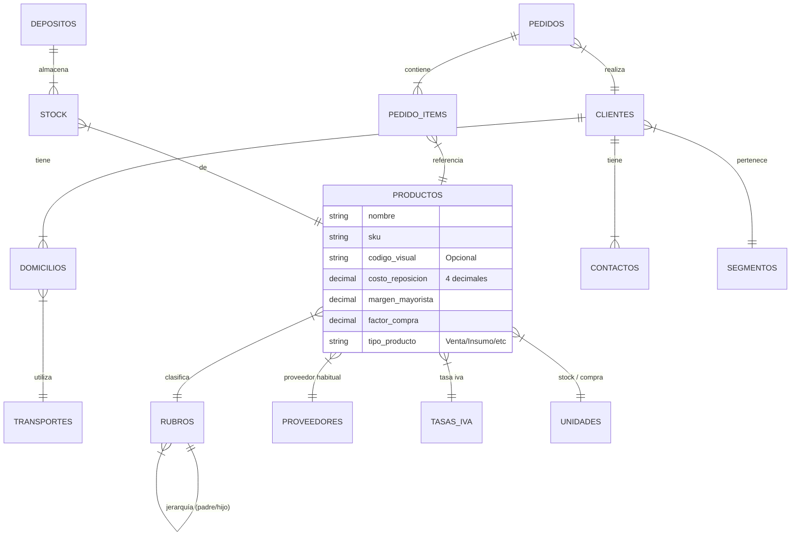

# Mapa del Modelo de Datos (V5)

Basado en la conversación actual, esta es la estructura "Pirámide" del sistema.

## Resumen de Módulos

### 1. Clientes (Estable)
- **Core**: Tabla `clientes`.
- **Logística**: `domicilios` (Entregas) y `transportes`.
- **Segmentación**: `segmentos` (Agrupación comercial).
- **Contactos**: Personas de contacto asociadas.

### 2. Productos (En Proceso)
- **Core**: Tabla `productos` (La ficha técnica).
- **Clasificación**: `rubros` (Árbol de categorías).
- **Costos y Precios**:
    - `costo_reposicion` (Base).
    - `margen_mayorista`.
    - `tasa_iva_id` (Alicuota).
    - `moneda_costo`.
- **Abastecimiento**:
    - `proveedor_habitual_id`.
    - `unidad_compra` vs `unidad_stock`.
    - `factor_compra` (Conversión).
- **Logística Interna**: `depositos` (Ubicación física del stock).

### 3. Pedidos (Vértice Superior - Futuro)
- Se alimentará de todo lo anterior para generar transacciones.
